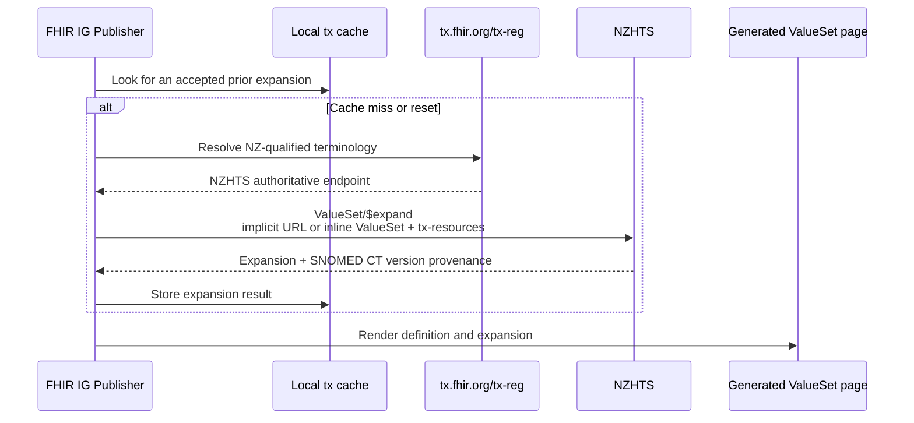

## NZ Edition SNOMED CT

FHIR uses `http://snomed.info/sct` as the code system URI for every SNOMED CT edition. The New Zealand edition is identified by the edition URI `http://snomed.info/sct/21000210109`, where `21000210109` is the identifying module for the [New Zealand Edition](https://docs.snomed.org/snomed-ct-practical-guides/snomed-ct-extension-guide/4-logical-design/4.4-editions/4.4.2-edition-uri-examples). This edition URI should be included in the `version` element, while the `system` element remains `http://snomed.info/sct`. A particular release is identified by appending `/version/YYYYMMDD`. The standard code system URI uses `http`, not `https`; these identifiers are not interchangeable.

There are two ways to include NZ edition codes in a FHIR IG. You can represent a small, fixed selection of NZ edition concepts locally, or refer to a server-resolved implicit SNOMED CT ValueSet. Local definitions make a deliberate snapshot available to the build and rendered guide; implicit ValueSets avoid copying the membership and allow a terminology server to evaluate the definition. In either case, the edition or release must be identified wherever ambiguity would otherwise remain.

### Local definitions for a fixed selection

For a small set of already-published NZ edition concepts, an IG may include a non-authoritative fragment of SNOMED CT and an enumerated ValueSet:

* Define a `CodeSystem` whose `url` remains `http://snomed.info/sct`, whose `version` is the NZ edition or release URI, and whose `content` is `fragment`. Add each required concept to `CodeSystem.concept` with its SCTID and official display; include a definition only when it comes from an authoritative source.
* Define a `ValueSet` with its own canonical URL. Set `compose.include.system` to `http://snomed.info/sct`, set `compose.include.version` to the NZ edition or release URI, and add one `compose.include.concept` for each code and display.
* Optionally include `ValueSet.expansion` as a point-in-time snapshot. Give it a `timestamp` and repeat the system, version, code and display in each `expansion.contains`. This can populate the expansion table in the rendered IG, but it is an expansion result, not the ValueSet definition, and must remain consistent with `compose` and the selected SNOMED CT release.

A fragment indicates the CodeSystem is a small part of a larger CodeSystem published elsewhere. See the FHIR R4 guidance on [CodeSystem fragments](http://hl7.org/fhir/R4/codesystem.html#4.8.7). 

This pattern is useful when a small, stable snapshot must render and validate without depending on a live expansion. It becomes a manual maintenance obligation, so an implicit ValueSet is generally preferable when the intended set is already defined by SNOMED CT hierarchy, reference-set membership or ECL.

#### Local CodeSystem Fragment example

The [SNOMED CT NZ Edition Smoking Status Fragment](CodeSystem-sct-nz-smoking-status-fragment.html) is a non-authoritative, release-pinned `CodeSystem` with `content = fragment` and four locally included concepts. Its companion [New Zealand Smoking Status ValueSet](ValueSet-nz-smoking-status.html#definition) enumerates the same codes in `compose.include.concept` and includes a point-in-time [expansion](ValueSet-nz-smoking-status.html#expansion) for the rendered page. The example canonical and release are illustrative and must be replaced or maintained for production use.

### Implicit SNOMED CT ValueSets

An [implicit ValueSet](http://hl7.org/fhir/R4/snomedct.html#implicit) uses a single predictable URL as the complete ValueSet definition; no local `ValueSet` resource is required. The base is `http://snomed.info/sct`, an edition URI such as `http://snomed.info/sct/21000210109`, or a release URI such as `http://snomed.info/sct/21000210109/version/YYYYMMDD`. Append one of the following query forms:

| Query | ValueSet defined |
| --- | --- |
| `?fhir_vs` | All concept IDs in the selected edition or release. |
| `?fhir_vs=isa/[sctid]` | The specified concept and all concepts subsumed by it. |
| `?fhir_vs=refset` | The concept IDs that identify reference sets explicitly defined in the selected edition. |
| `?fhir_vs=refset/[sctid]` | The active members of the specified reference set. |
| `?fhir_vs=ecl/[ecl]` | All concept IDs matching the supplied URI-encoded Expression Constraint Language expression. |

For example, this URL defines the members of the New Zealand COVID-19 adverse reaction event from immunisation reference set:

```text
http://snomed.info/sct/21000210109?fhir_vs=refset/61231000210108
```

Using the bare NZ edition URI selects the latest available NZ release, so membership may change over time. Insert `/version/YYYYMMDD` before the query when a reproducible release is required. If the base is only `http://snomed.info/sct`, the edition is unresolved and must be selected by the terminology service or by the build-wide default described below; use an edition-qualified URL for NZ-only reference sets and other NZ-specific content.

#### Example of Implicit reference-set binding

 The [New Zealand Immunisation Reaction Event](StructureDefinition-nz-immunisation-reaction-event.html) binds `Observation.code` directly to the NZ edition implicit reference-set URL shown above. The [example Observation](Observation-immunisation-reaction-event-example.html) uses the shared SNOMED CT system URI and identifies the NZ edition in `Coding.version`; the related [COVID-19 Immunisation example](Immunization-covid-immunisation-example.html) references that reaction event.


### Treating unversioned SNOMED CT as the NZ edition during a build

When an IG refers only to `http://snomed.info/sct`, the IG Publisher cannot infer the NZ edition merely from the IG jurisdiction. It may otherwise use the International Edition, causing NZ concepts or reference sets to appear unknown. A FHIR `Parameters` resource can provide a build-wide [`system-version` default](http://hl7.org/fhir/R4/valueset-operation-expand.html) for unversioned references.

For a standard SUSHI project, save this complete resource as `input/_resources/exp-params.json`:

```json
{
  "resourceType": "Parameters",
  "id": "exp-params",
  "parameter": [
    {
      "name": "system-version",
      "valueUri": "http://snomed.info/sct|http://snomed.info/sct/21000210109"
    }
  ]
}
```

Then merge [`path-expansion-params`](https://build.fhir.org/ig/FHIR/fhir-tools-ig/CodeSystem-ig-parameters.html#ig-parameters-path-expansion-params) into the existing `parameters` block in `sushi-config.yaml`. If the IG also publishes a local SNOMED CT fragment, add `special-url` for its external canonical:

```yaml
parameters:
  path-expansion-params: ../../input/_resources/exp-params.json
  special-url:
    - http://snomed.info/sct
```

The `special-url` entry is needed only when the IG publishes the local fragment. The `system-version` value has the `system|version` form: the left side identifies the unversioned system and the right side supplies its default edition. The bare edition URI selects the latest NZ release available to the terminology server; replace it with `http://snomed.info/sct/21000210109/version/YYYYMMDD` to pin the build. The `../../` path is relative to the generated `ImplementationGuide` under `fsh-generated/resources`.

`system-version` is a default, not an override: it does not replace an explicit `ValueSet.compose.include.version`, edition-qualified implicit ValueSet URL or `Coding.version`, and it does not rewrite published resources. Use `Coding.version` when an exchanged coding must identify the NZ edition or release outside the IG build. The terminology server must also host the selected edition or release.

### Expansion through the terminology ecosystem and NZHTS

For remote terminology work, the Publisher first checks its local terminology cache and available local or package artifacts. If it still needs an expansion, it asks the terminology co-ordination service to resolve the edition-qualified request. Because NZHTS is registered as authoritative for the NZ edition of SNOMED CT, the co-ordination result can direct the Publisher to NZHTS rather than the shared HL7 terminology server, which does not carry the NZ edition. See [NZHTS and the HL7 FHIR terminology ecosystem](tx-ecosystem.html) for the complete routing process.

The request to NZHTS may contain an implicit SNOMED CT ValueSet URL or a local `ValueSet` supplied inline in `Parameters.valueSet`, with related `tx-resource` artifacts where needed. This allows a ValueSet defined only in the IG to be evaluated against authoritative NZ content. NZHTS returns the expansion and the SNOMED CT version used; the Publisher caches that result and uses it to render the ValueSet expansion page. `qa-txservers.html` shows which server the build actually contacted and should be checked when NZ content does not resolve as expected. Licensed content such as SNOMED is likely to require authentication to access on NZHTS - see [NZHTS authentication configuration](Authentication.html) for setup details.


