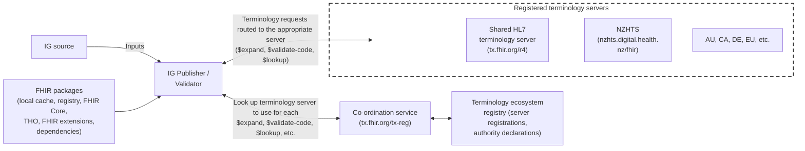
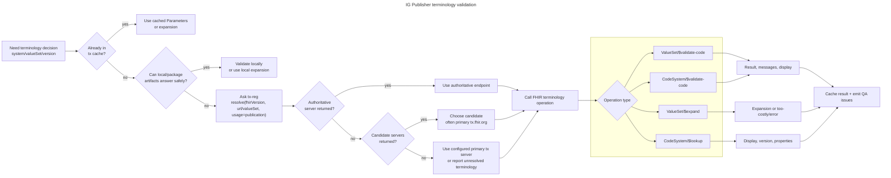
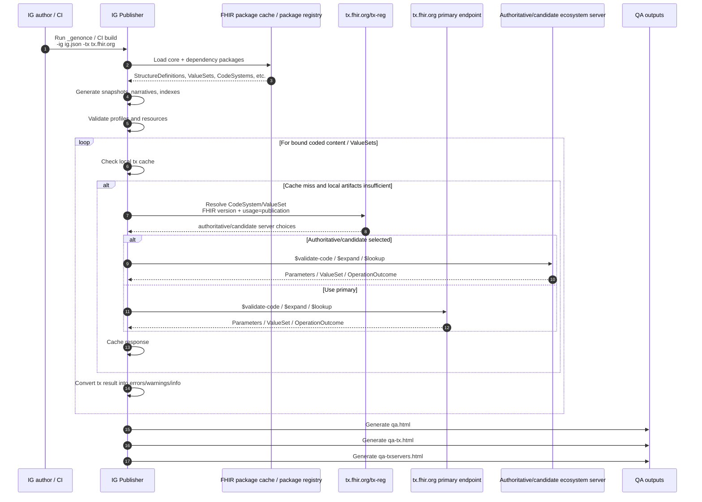
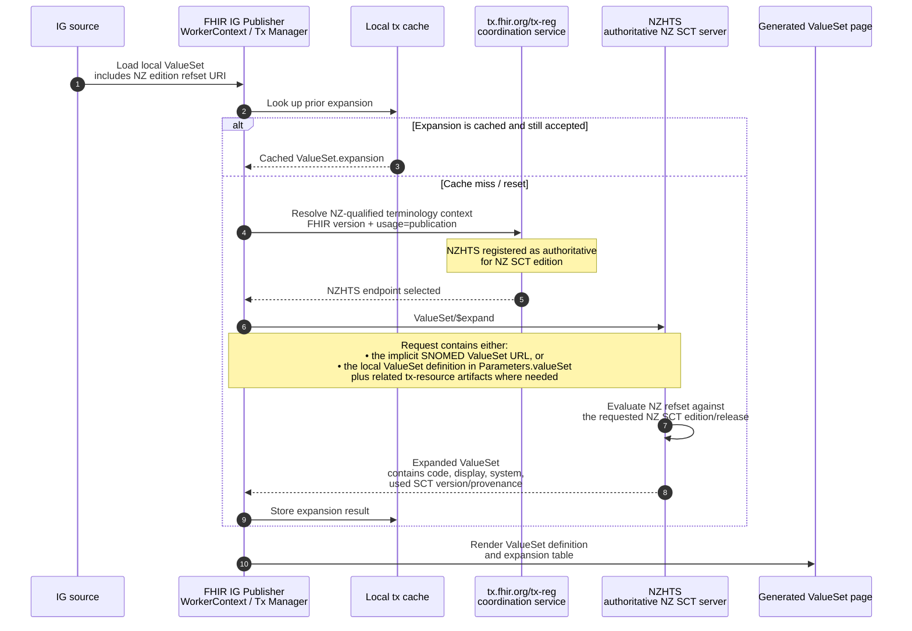

## NZHTS & the HL7 FHIR terminology ecosystem

NZHTS is a registered participant in the HL7 FHIR terminology ecosystem, and can be declared as the authoritative server for terminology artifacts used in NZ such as the NZ edition of SNOMED CT. That declaration allows the IG publisher to resolve NZ terminology against NZHTS automatically.

This page describes how that works: the actors involved, how the IG Publisher decides which terminology server to call, and what happens end to end during a build.

### Overview of Tx Ecosystem main components / actors

The diagram below shows the moving parts and how they relate to each other.

* **IG source and FHIR packages** are the inputs to a build — your own profiles, value sets and examples, plus the core FHIR, THO and dependency packages resolved from the local package cache or the package registry.
* **The IG Publisher / Validator** is the client. It needs to make terminology decisions (is this code valid? what does it display as? what is in this value set?).
* **The co-ordination service** (`tx.fhir.org/tx-reg`) is the directory/lookup service. Given a code system or value set URL and a FHIR version, it answers the question *"which server should I ask?"*
* **The terminology ecosystem registry** holds the underlying data — which servers exist, what they support, and which of them have declared authority over particular terminologies.
* **The registered terminology servers** respond to the actual terminology service queries. These include the shared HL7 server (`tx.fhir.org/r4`), NZHTS, and the equivalent national and regional servers for AU, CA, DE, the EU and others.

The important consequence is that the Publisher talks to the co-ordination service *about* terminology, and to the registered servers *for* terminology. NZHTS sits in the second group, and is reached because the registry points to it.

### FHIR IG publisher terminology validation routing

Whenever the Publisher hits coded content it needs to make a decision about, it works through the sequence below. The key point for IG authors is that **calling a terminology server is the last resort, not the first step** — the Publisher tries progressively more expensive options in order:

1. **Local tx cache.** If the same question has been answered before, the cached result is reused. This is why a warm cache makes builds dramatically faster, and why clearing the cache forces a full round of server calls.
2. **Local and package artifacts.** If the code system is small, complete and present in the build (a local code system, or one supplied by a dependency package), the Publisher can answer safely without any server at all.
3. **Ask the co-ordination service.** Otherwise the Publisher calls `tx-reg` with the FHIR version, the code system or value set URL, and `usage=publication`, asking which server to use.

The response then determines routing. If a server has declared **authority** for that terminology, its endpoint is used — this is the path NZ SNOMED CT and NZ code systems take to NZHTS. If there is no authoritative server but there are **candidates**, one is chosen, typically the primary `tx.fhir.org`. If neither is returned, the Publisher falls back to whatever primary tx server the build was configured with, or reports the terminology as unresolved.

Once an endpoint is selected, the actual FHIR operation is issued — `ValueSet/$validate-code`, `CodeSystem/$validate-code`, `ValueSet/$expand` or `CodeSystem/$lookup` — and the result is cached and turned into QA output. Note that `$expand` can return a "too costly" response rather than an expansion for a large or open-ended value set.

### End to end terminology flow for an IG build

The previous diagram showed the decision logic in isolation. This sequence diagram shows it in the context of a complete build.

The build starts with package loading and the structural work — snapshot generation, narratives, indexes and profile validation. Terminology resolution then runs as a **loop over every piece of bound coded content**, applying the cache / local / registry sequence described above. A single IG can generate a very large number of these checks, which is why cache behaviour has such a visible effect on build times.

Each terminology response is converted into errors, warnings or informational messages, and surfaced in three QA artefacts worth knowing about:

* **`qa.html`** — the overall build QA report, including terminology-derived errors and warnings alongside everything else.
* **`qa-tx.html`** — the terminology-specific report. This is the file to open when you are debugging why a code will not validate or a value set will not expand.
* **`qa-txservers.html`** — a summary of *which* terminology servers were actually contacted during the build. For an NZ IG, this is the quickest way to confirm that NZ content genuinely resolved to NZHTS rather than silently falling back to the primary server.

### NZ edition SNOMED CT ValueSet Expansion via Tx-ecosystem/NZHTS

This final diagram is the NZ-specific case, and shows a value set that draws on the New Zealand edition of SNOMED CT via an NZ reference set.

The flow follows the same general pattern, but with one difference. When the Publisher asks the co-ordination service to resolve NZ-qualified terminology, the registry returns **NZHTS as the authoritative server**, because NZHTS has declared authority for the NZ SNOMED CT edition. The expansion is therefore evaluated by NZHTS against the correct NZ edition and release — something the shared HL7 server cannot do, since it does not carry the NZ edition.

Two details are worth calling out:

* **What gets sent.** The request may carry either the implicit SNOMED CT value set URL, or the local `ValueSet` definition supplied inline in `Parameters.valueSet`, along with any related `tx-resource` artefacts the server needs to evaluate it. The second form is what allows a value set defined in your own IG — one that has never been published to NZHTS — to still be expanded correctly against NZ content.
* **What comes back.** The expansion includes the codes and displays, and also records the SNOMED CT version actually used. That provenance is what makes the rendered value set page reproducible and traceable to a specific NZ release.

The result is cached like any other terminology response, and then rendered into the generated value set page in the published IG.

