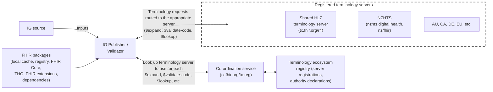
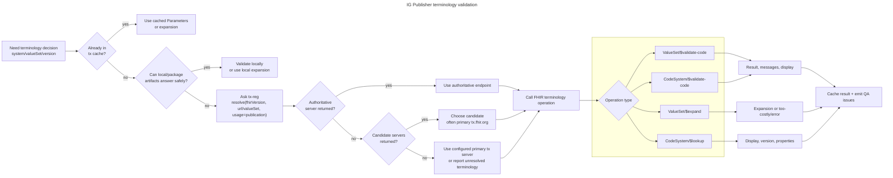
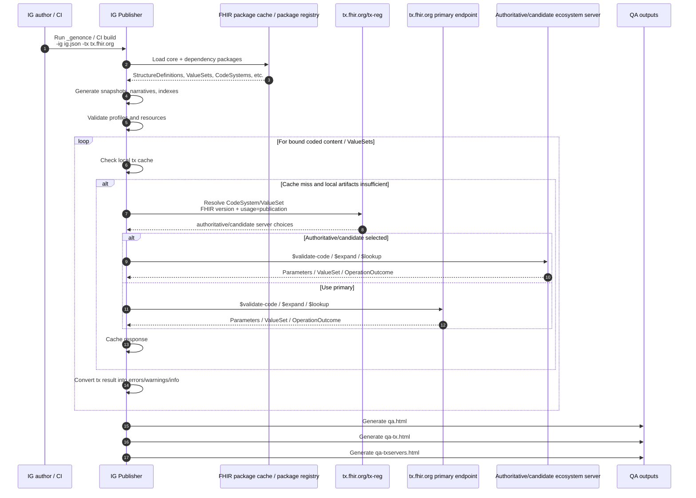
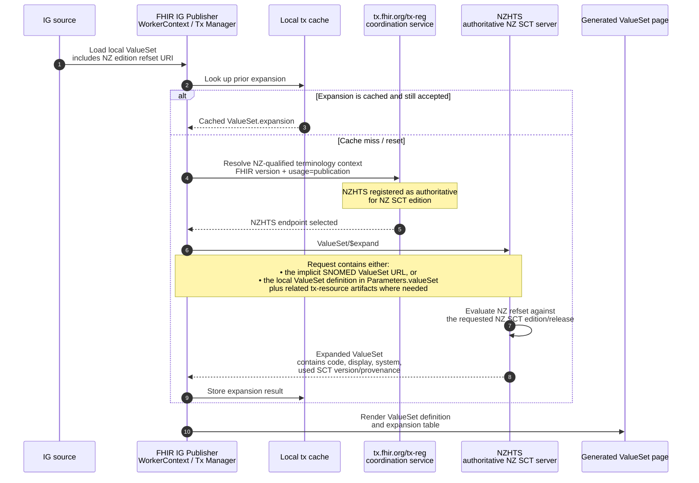

## NZHTS & the HL7 FHIR terminology ecosystem

### Overview of Tx Ecosystem main components / actors

### FHIR IG publisher terminology validation routing

End to end terminology flow for an IG build

NZ edition SNOMED CT ValueSet Expansion via Tx-ecosystem/NZHTS

